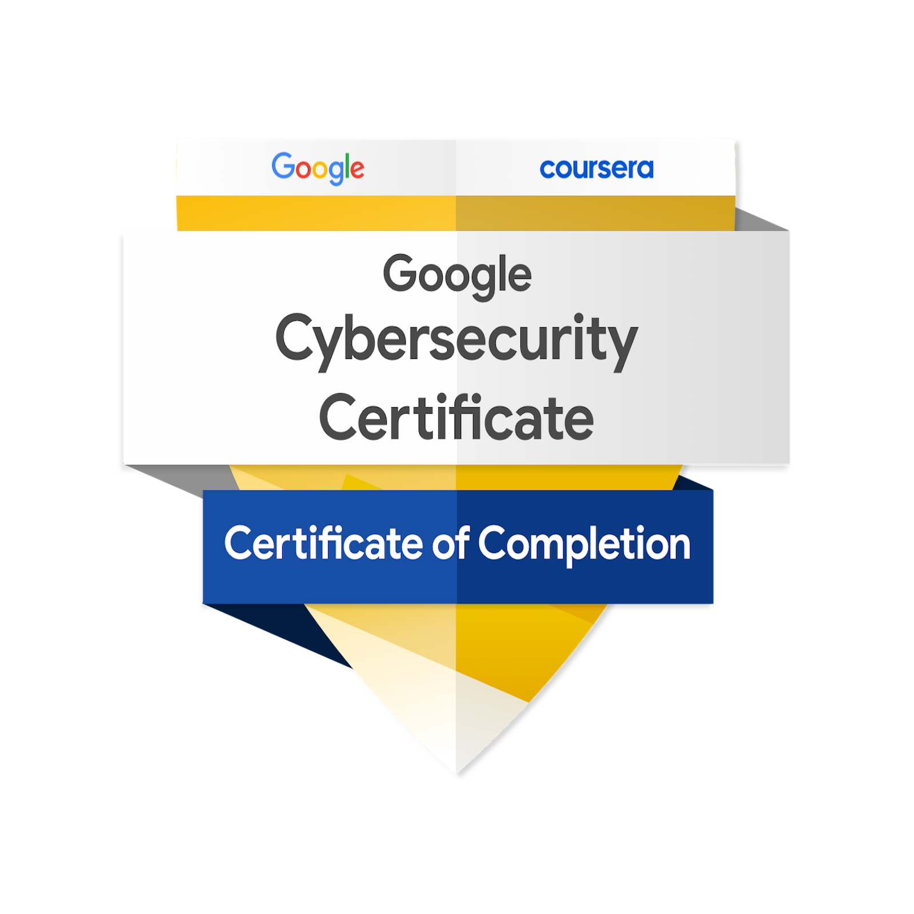
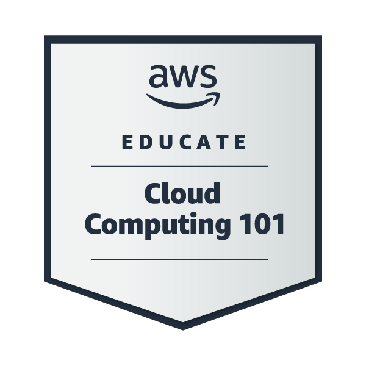
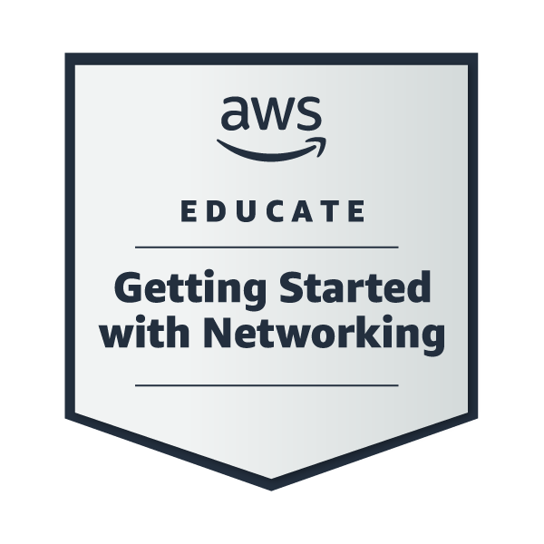
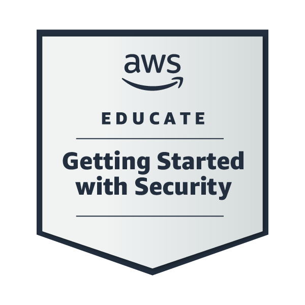
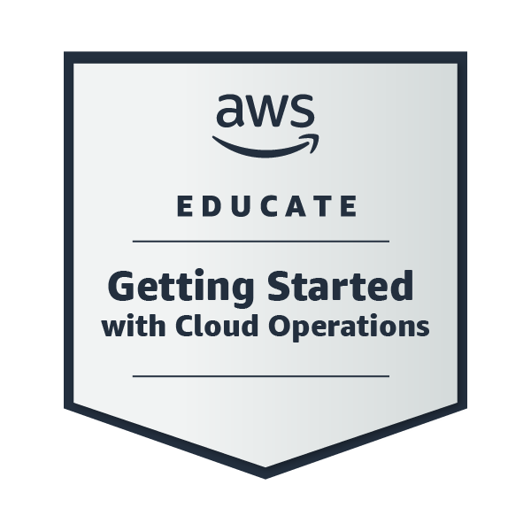
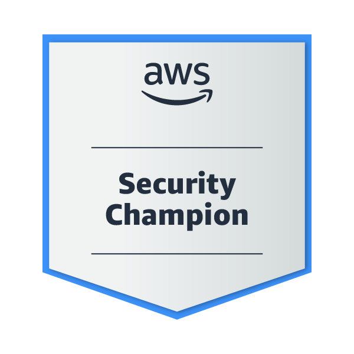
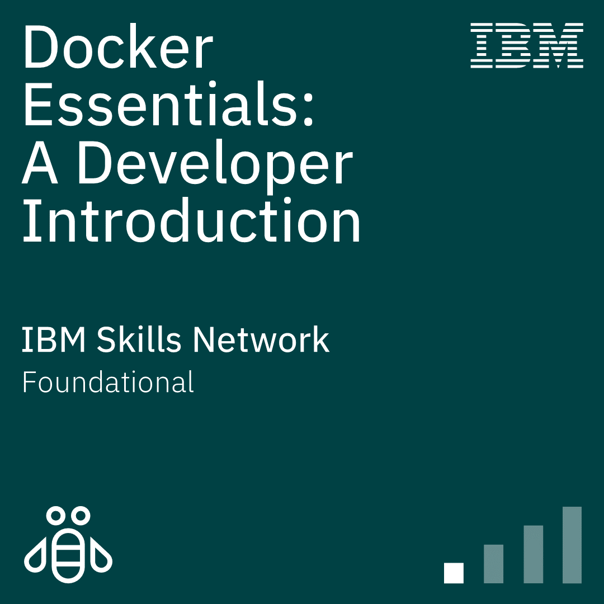
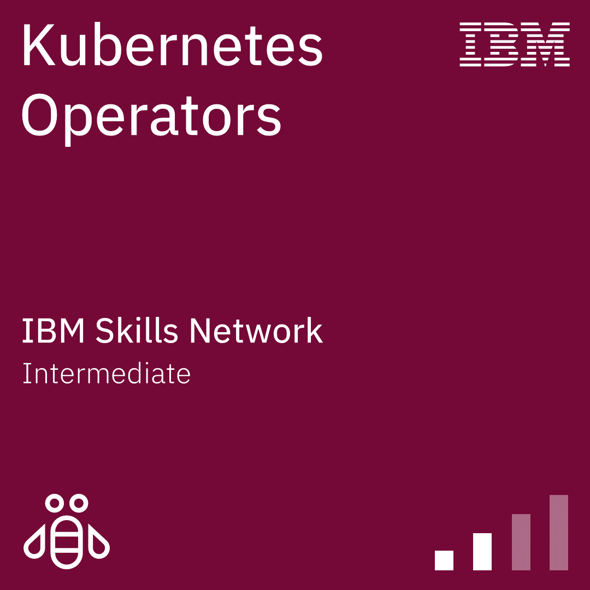
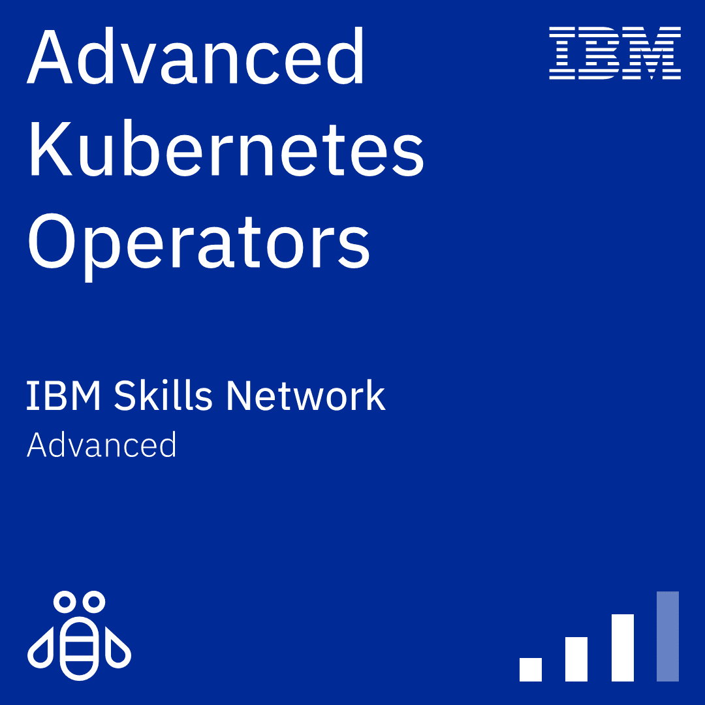

<!-- Header Banner -->

  

<table>
<tr>
<td width="70%">

# *Hey, Noufa here!*
With a focus on **cloud security automation & DevSecOps**, I design and deploy solutions that bring together infrastructure as code, CI/CD pipelines, and real-time monitoring.  
I work around **AWS, Terraform, Kubernetes, Jenkins, Docker, SonarQube, and Grafana**, delivering secure and resilient applications.

  
  
  
  
  
  
  

</td>
<td width="30%" align="center" style="padding-left:20px;">

</td>
</tr>
</table>

# Badges

  <!-- ROW 1 (110px, tighter spacing) -->
  
  
  
  
  
  
  

  <!-- ROW 2 (90px, neat spacing) -->
  
  
  

# *What I Do*
- Build secure and reliable CI/CD pipelines following DevSecOps best practices  
- Automate cloud infrastructure provisioning with Terraform and AWS  
- Containerize and orchestrate applications using Docker and Kubernetes  
- Implement monitoring, logging, and observability with Grafana and Prometheus  
- Manage access, roles, and compliance through IAM and security policies  
- Apply Infrastructure as Code (IaC) principles to ensure repeatable, scalable deployments  
 

