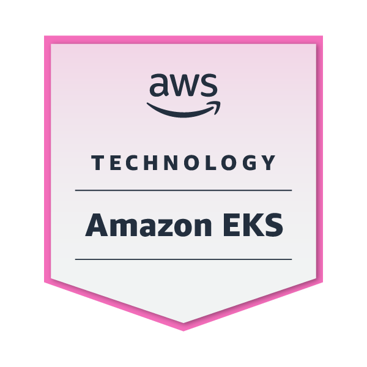

<!-- Header Banner -->

  

  
<table>
<tr>
<td width="70%">

# *Hey, Noufa here!*
With a focus on **Cloud Security Automation & DevOps**, I design and deploy solutions that bring together **infrastructure provisioning, application delivery, and security enforcement**. I create secure, scalable, and automated environments that help teams deliver faster while staying compliant and resilient. My work spans **AWS, Terraform, Kubernetes, Jenkins, Docker, SonarQube, and Grafana**, with an emphasis on efficiency, automation, and security.  

I use **IaC with Terraform** for cloud provisioning, build CI/CD pipelines in **Jenkins** to automate deployments, and manage containerized workloads with **Docker & Kubernetes**. I integrate **SonarQube** for continuous code quality and **Grafana** for real-time observability. Alongside automation, I prioritize **cloud security best practices** from IAM design and compliance checks to vulnerability scanning, ensuring every solution is high-performing, secure, and resilient.  

  
  
  
  
  
  
  

</td>
<td width="30%" align="center" style="padding-left:20px;">

    

</td>
</tr>
</table>

<h1>
  <!-- The original GIF as header -->
  

  <!-- Clickable Credly logo next to it -->
  
</h1>

  <!-- ROW 1 (110px, tighter spacing) -->
  
  
  
  
  
  
  

  <!-- ROW 2 (90px, neat spacing) -->
  
  
  

<h1>
  
  <em>Certs</em>
</h1>

  
  
  
  
    

<h1>
  
  <em>What I Do!</em>
</h1>

- Build secure and reliable CI/CD pipelines following DevOps/DevSecOps best practices  
- Automate cloud infrastructure provisioning with Terraform and AWS  
- Containerize and orchestrate applications using Docker and Kubernetes  
- Implement monitoring, logging, and observability with Grafana and Prometheus  
- Manage access, roles, and compliance through IAM and security policies  
- Apply Infrastructure as Code (IaC) principles to ensure repeatable, scalable deployments

<h1>
  
  <em>Contact</em>
</h1>

  

  

  

  

  

